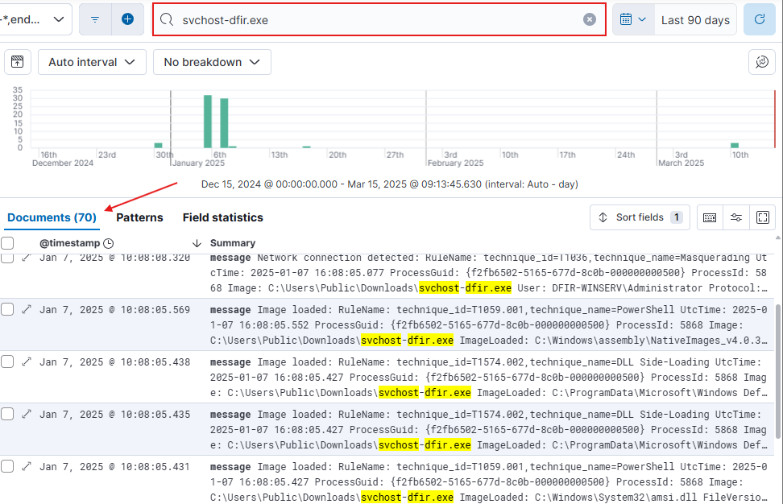

# 7.0. Mythic C2 Activity Investigation

7.0. There was an execution of a suspicious service ran on the Windows Server under the name of **svhost-dfir.exe**

7.1. By searching up this executable, it can be seen that **70 events** have been generated by it as well



**Note -** Usually a way of spotting C2 activity is by identifying the **top 10 address pairs** talking back and for or especially constant communication outside of the network to a specific address. Another way of identifying C2 activity is by checking for “heartbeats” sent between an infected host and C2, or **process/network creations**

7.2. Using the following query to check if any network connections were established between the suspicious IP and Windows Server, it can be seen that **3 events** were generated from it. From this, it can be seen that an outbound network connection was made 

- **January 7, 2025 @ 9:51** towards the IP **45.76.30.116**
- **January 7, 2025 @ 10:02** towards the IP **45.76.30.116**
- **January 7, 2025 @ 10:08** towards the IP **45.76.30.116**

```jsx
event.code: 3 and winlog.event_data.DestinationIp: 45.76.30.116
```


**Note -** If sysmon telemetry is available, always look at the **Process GUID (winlog.event_data.ProcessGuid**) 

7.3. Select the first event generated and scroll to the Process GUID of this event. It can be seen that a file was created using PowerShell and the file name was **svchost-dfir.exe** and was under the directory of 	**C:\Users\Public\Downloads\**

- **Jan 7, 2025 @ 09:51** File Created: **svchost-dfir.exe** under **C:\Users\Public\Downloads\**


7.4. It can then be seen that a **Network Connection** was created from the Windows Server (216.128.147.170) to the Mythic C2 Server (45.76.30.116)

.png)

7.5. Afterwards, a new **File executable** was ran (svchost-dfir.exe) with the SHA1 Hash of SHA1=F67FEF283D4E6E28E3887D905FB93B48BCC24701, which can be used in the search as well as verifying with VirusTotal

7.6. The executable was known to have been run because an event for **Process Create** has been generated. Take note of the **Process GUID ({f2fb6502-500e-677d-830b-000000000500})** which is the Process GUID of the actual executable (svchost-dfir.exe)


7.7. After having found the actual Process GUID of the executable file **svchost-dfir.exe,** we can search for it in Elasticsearch. It can be seen that the Process was created at the following

- **Jan 7, 2025 @ 10:02:23 -** Process Created: svchost-dfir.exe


7.8. Look for both the **Process/Parent ID** (winlog.event_data.ParentProcessId and winlog.event_data.ProcessId) under the **Process Created** event. 

- **PID - 5352**
- **Parent PID - 5732**


7.9. Using the **PID,** look for anymore **process** that may have been spawned from this Process ID since they will be malicious

- In this case, no child processes have been spawned from this Process ID, so the only known malicious process as of now is svchost-dfir.exe

```jsx
winlog.event_data.ParentProcessId: 5352
```

.png)

7.1.0. A ticket can also be seen as generated since a mythic rule was put in place to create a ticket whenever C2 activity was discovered


