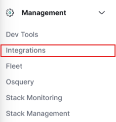

# 8.0. Setting up Elastic Defend and Deploying with Fleet Server

8.0. In Elastic, go to **Management → Integrations,** then select and add **Elastic Defend**

8.1. Configure Elastic Defend to the desired settings. Because this endpoint is going on a **Windows Server,** ensure **Traditional Endpoints** is selected from the dropdown pertaining to environment type

8.2. The **Complete EDR (Endpoint Detection & Response)** should be selected 

8.3. Under **Where to add this integration,** choose **Existing hosts** and select the **Windows Machine**. Next, select **Save & Continue**

- It is good to have a fleet server because all the agents can then be managed from a centralized location

.png)

8.4. If Elastic Defend has been added successfully, go to **Security → Manage** and the EDR for the Windows Sever should say **Healthy**

.png)

8.5. Under actions, there are various actions that can be taken against an infected host such as: **Isolation, response, etc**

